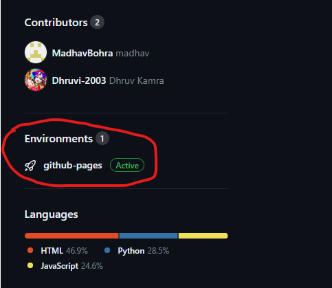
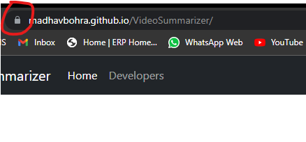
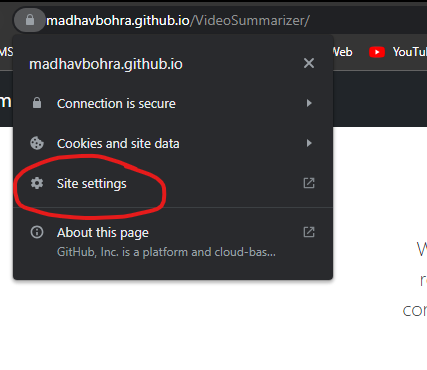
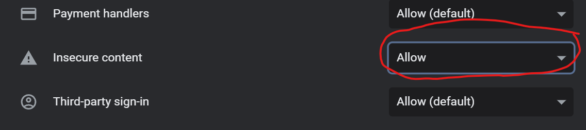
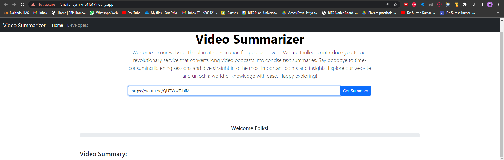

# How to Use Our Tool :

### 1. Click on the link provided on our github repo :

or click this link : https://madhavbohra.github.io/VideoSummarizer/index.html

### 2. Disable security of the browser :

Our project is hosted on digital ocean so we were not able to generate the SSL certificate, so to test our frontend this is the workaround : 

after clicking on the lock icon, select the site settings from the drop down :

After that scroll down and allow insecure content, which is allow our site to make http request as we don't have SSL certificate.

---

### 3. Enjoy the Tool :

